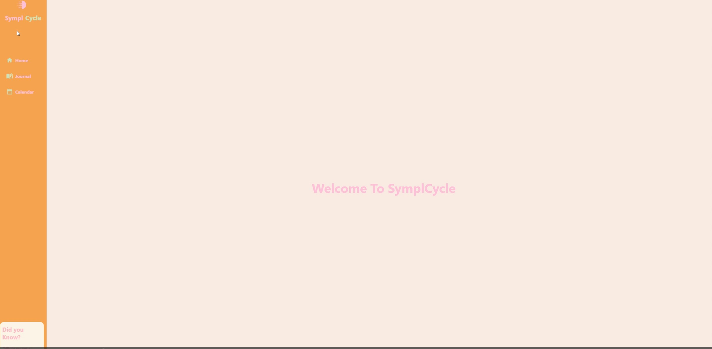

SymplCycle

SymplCycle is a desktop application built with React and Electron that helps women track and understand their menstrual cycles in a clear, supportive, and organized way. The app provides tools for logging symptoms, recording daily thoughts and feelings, and viewing cycle information through an intuitive calendar.

Purpose

SymplCycle was created to offer a reliable, user-friendly space for menstrual health tracking without unnecessary complexity. While many apps focus mainly on predictions, SymplCycle emphasizes self-awareness, daily reflection, and health pattern insight. The goal is to help users connect emotional and physical experiences to different phases of their cycle without the 
need for any sort of payment or obligation from the users. 

Mission

The mission of SymplCycle is to empower women with a better understanding of their own bodies by giving them clear access to their cycle data and daily health patterns. The app aims to:

Help users recognize trends across their cycle

Encourage informed, confident conversations with healthcare providers

Reduce uncertainty by providing a private, consistent tracking tool

Promote wellness through better awareness, reflection, and documentation

SymplCycle is built on the idea that menstrual health is a key part of overall wellness. The focus is not just on collecting data, but on helping users interpret and benefit from it.

Features

Daily Journal for documenting moods, physical symptoms, and personal notes

Symptom Tracker to identify recurring patterns throughout each cycle

Cycle Calendar to log menstruation days and track each phase

Clean, accessible UI powered by React

Cross-platform support through Electron

Images: 

